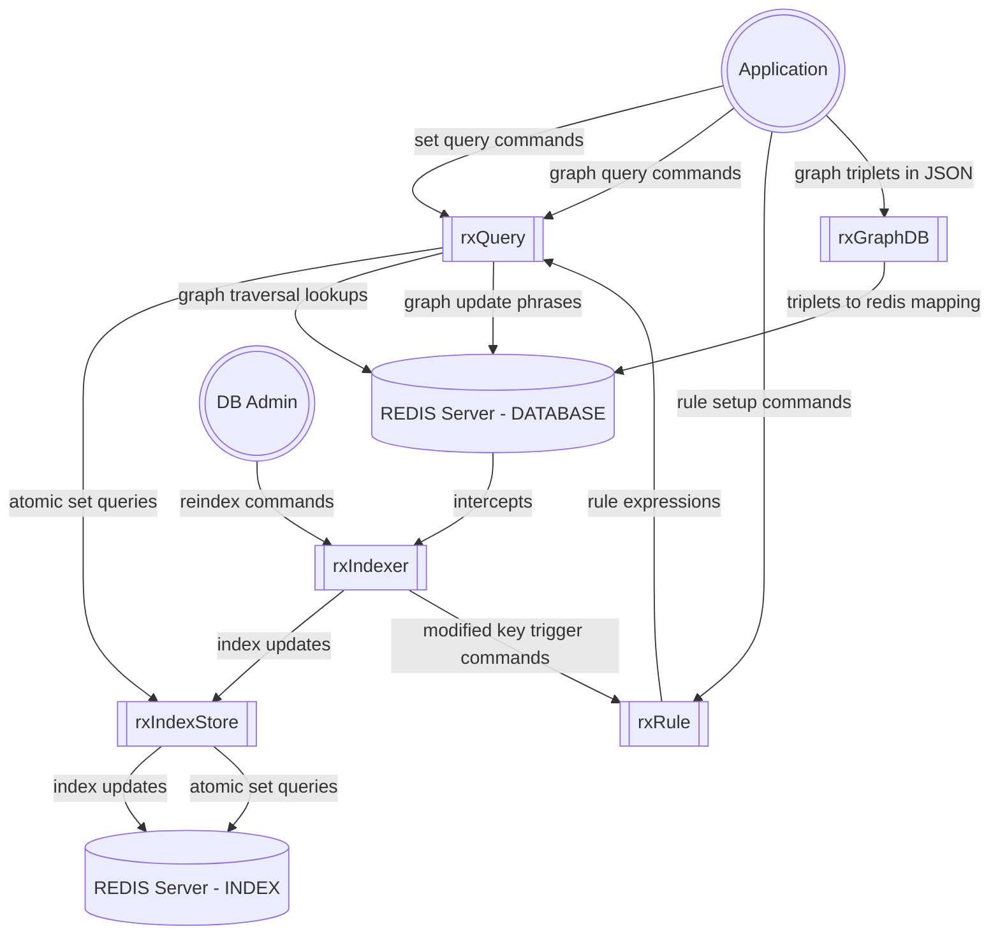
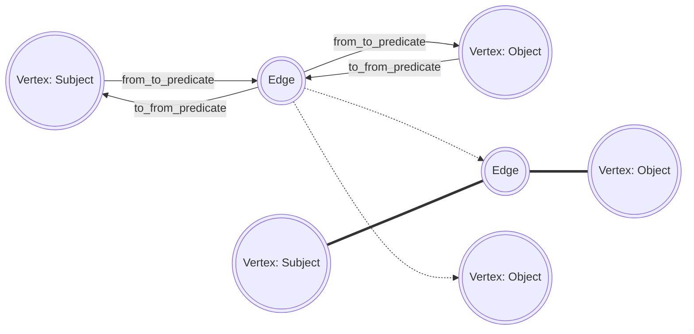

# Redis-Mercator
A suite of module which adds full text search, graph traversal, graph db mapping, full text indexing, buseness rules, set operations and more to a standard REDIS installation.

Gerardus Mercator was a 16th-century geographer, cosmographer and cartographer from the County of Flanders. He is most renowned for creating the 1569 world map based on a new projection which represented sailing courses of constant bearing as straight lines—an innovation that is still employed in nautical charts.

Redis Mercator provides alternative views and traversals on your Redis data, offering:
1) Set operations.
2) Graph operations.
3) Business Rules (triggers).

# Build instructions
1) Create a folder 'Extensions' in your Redis folder
2) Clone this project in the extensions folder.
    fetch https://github.com/cameron314/concurrentqueue.git in deps
    pip3 install redis
3) 'MAKE' to compile
4) 'MAKE test' to execute the system tests.

# Modules

The following modules are part of the **Mercator** suite and can be loaded into Redis using the *MODULE LOAD* command.

## rxIndexer.so

The rxIndexer module add *Full Text Ind3exing* to Redis *String*, *Has* and *List* keys. 
An application does not need to be altered to use special commands to data indexed. Instead the module:
1) Intercepts the approriate *Redis* commands.
2) Extracts data to be indexed.
3) Update the Mercator index asynchronously.
4) For rxRule integration: Every indexed key is scheduled for business rule evaluation.

## rxQuery.so  

The rxQuery modules add set based and graph based query capabilities to Redis server.

The *rxQuery* command can operate:
1) On the index created by the rxIndexer module.
2) Traverse on Redis keys as a GraphDb using a Gremlin like syntax.
3) The set and traversal operators can be combined in a single query operations.

Query expressions feel natural. Some samples:

| Question | Style| Query |
| --------- |----| ----- |
| Who has lived in 'Amsterdam' and 'Hoogkarspel'? | Set | rxquery amsterdam & hoogkarspel |
|  | Graph | rxquery amsterdam & hoogkarspel |
| Who has lived in 'Amsterdam' or 'Hoogkarspel'? | Set | rxquery amsterdam hoogkarspel  |
| | Graph | rxquery  g.v(amsterdam,hoogkarspel).inout(woonplaats_van).by(object) |
| All persons with his/hers known father and/or mother| Graph + Set | rxQuery g.v.(as(all).in(vader)\|as(all).in(moeder)).by(subject) |
| | Graph | rxQuery g.v.in(vader,moeder)).by(subject) |

## rxRule.so  

The rxRule module add the capabilities to define 'Business Rules' on your Redis Database. The Business Rules maintains active sets.

After the completion of any ***WRITE*** Redis command:
1) All standing business rules are applied against the *triggered* key, by executing the compile *Graph* query.
2) When the The business rules yields a populated set,
    a) Then the key is added to  the monitored add to the business rules.
3) When the The business rules yields an empty set,
    a) Then the key is added to  the monitored removed from the business rules.
    
The  *Graph* query may contain *WRITE* actions, like adding a property or Edge.

## rxGraphdb.so 

The rxGraphdb module makes it possible to load a JSON document with triplets as vertices and edges to a Redis database.

1) Every Vertex is mapped to a Redis Hash Object.
2) Every Edge is mapped to a Redis Hash Object.
3) Every **Edge** consists of four directed graphs. All directed graphs mapped to SET objects. 

Nested *Triplets* are allowed.

## rxIndexStore.so   

The rxIndexStore module turns a Redis Server in a Mercator index and performs the following:
1) Maintains the index.
2) Fetch atomair query expresssions for set based queries.

# Graph DB 

## Verticed and Edges

## Triplets

# Libraries

## queryEngine.so   

The Query parser and executors in C.

## sjiboleth.so

The Query parser and executors in C++.
The Query dialects may be extended with custom elements from Redis Modules.

# C vs C++ vs Rust

Initially the indexer and query language and engine were developed in C. After an AWS/IAM prototype module was developed in Rust I attempted to move the code to Rust. After a while I stopped and continued further developments in C++.

## Rust

Allthough the Rust is an appealing language but I missed:

